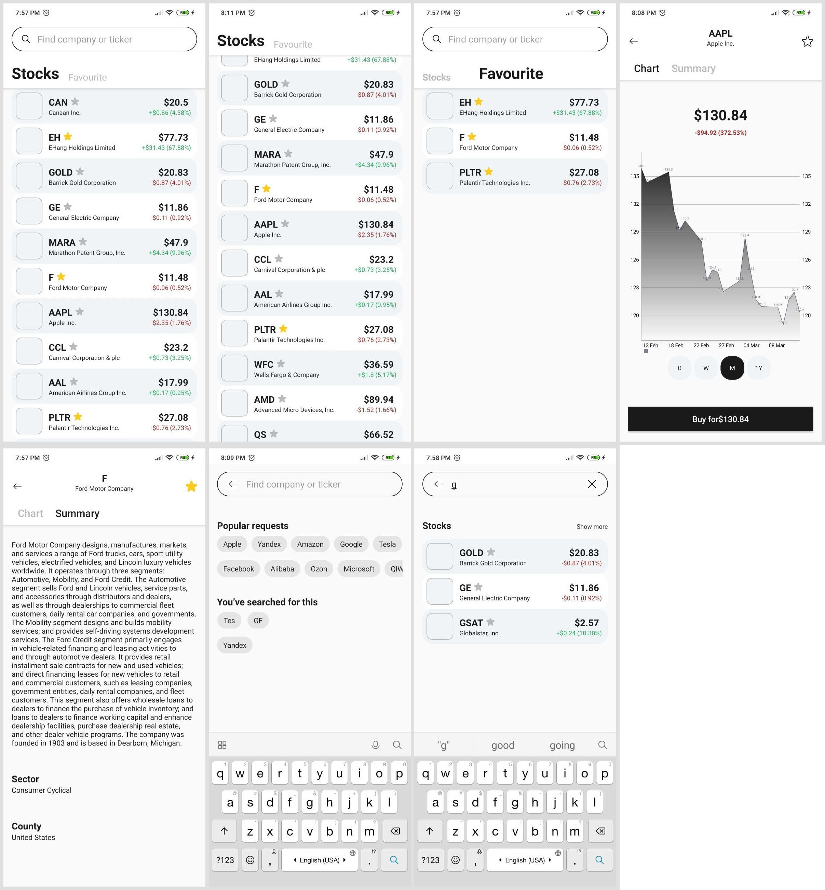

# Ya Stocks

Android application (testing task for Yandex MDS)

## Краткие факты

- Общая архитектура приложения MVVM
- В качестве API был выбран сервис [MBOUM](https://mboum.com/api/documentation)
- Для запросов используется Retrofit2
- Результаты запросов сохраняются в БД Realm. (можно зайти в приложение без интернета)
- Запрос на обновление котировок каждые 10 сек (через Timer)
- Для отображения графика используется библиотека [MPAndroidChart](https://github.com/PhilJay/MPAndroidChart)

Экран 1 (Главный):

- Во вкладке Stocks отображает спиосок наиболее торгуемых акций, во вкладке Favourite - избранные.
- AppBarLayout (SearchView & кастомный TablLayout) и ViewPager для 2-ух фрагментов (Stocks & Favourite).
- Во фрагментах Stocks и Favourite используется RecyclerView c кастомным адаптером и подпиской на LiveData.

Экран 2 (Информация об акции):

- тут можно добавить акцию в избранное
- по разметке аналогичен 1-ому экрану
- Фрагмент Chart:
	- отображает график, можно выбрать интервал (день(шаг 5мин), неделя(шаг 30мин), месяц(шаг 1день), год(шаг 1неделя))
- Фрагмент Summary:
	- описание компании
	- страна эмитента
	- сектор экономики

Экран 3 (Поиск):

- фрагмент с популярными акциями и историей поиска
	- популярные акции берутся из строкового массива в ресурсах
	- максимальная длина истории = 10 запросов
	- запросы сохраняются в SharedPreferences
	- все это представляется в виде виджетов Chip 
- фрагмент, который отображет список акций при поиске
	- не учитывается регистр (маска: name*)

## API

BaseUrl = https://mboum.com/api/v1/

Токен передается в хэдере запроса с ключом X-Mboum-Secret

1. **GET co/collections/?list=most_actives - Получение самых торгуемых котировок**

2. **GET qu/quote/profile/ - Информация об эмитенте**

		- symbol: string

3. **GET hi/history/ - Исторические данные для графика**

		- symbol: string
		- interval: string	| 5m, 30m, 1d, 1w
		- diffandsplits: boolean
